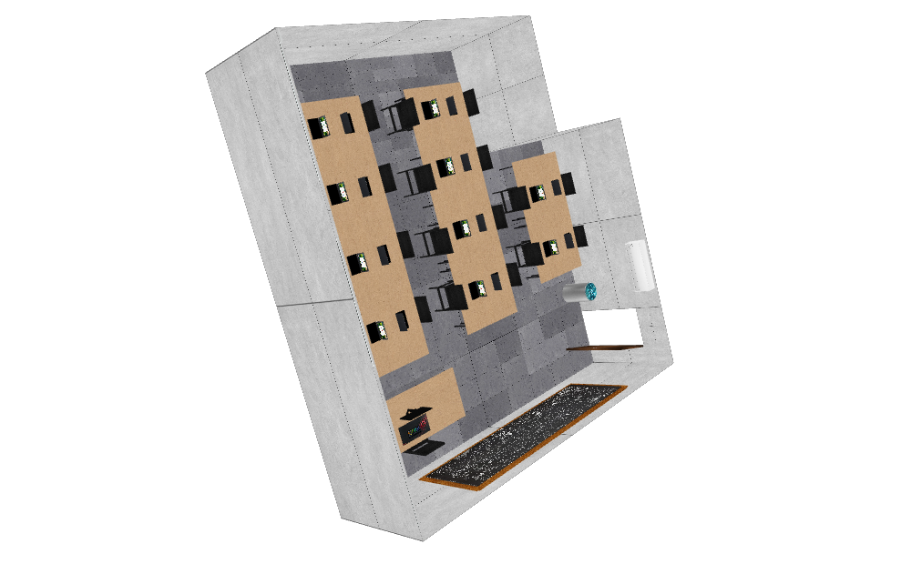

<h1>Modelagem X3D<h1>

<p align="center">
    <a href="#Sobre">Sobre</a>
    <a href="#Instalação">Instalação</a>
</p>



# Sobre
<p>No projeto em questão, realizamos o desenvolvimento um ambiente 3D utilizando o X3DOM. 
O Cenário foi inspirado na nossa sala na UNINOVE.</p>

# Instalação
```linux
git clone https://github.com/krzgvfs/Projeto-X3D.git
```
- Abra a pasta do projeto no Visual Studio Code.

- Instale a extensão <b>Live Server<b> no Visual Studio Code.

- Abra o arquivo <b>index.html<b> e clique em <b>Go Live<b> no parte inferior direita tela.
